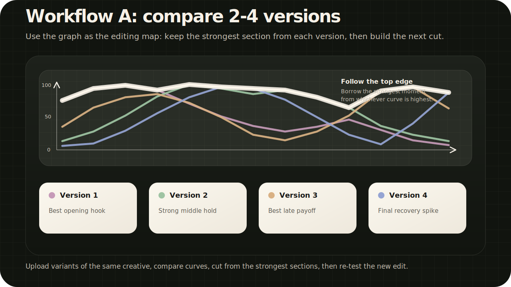
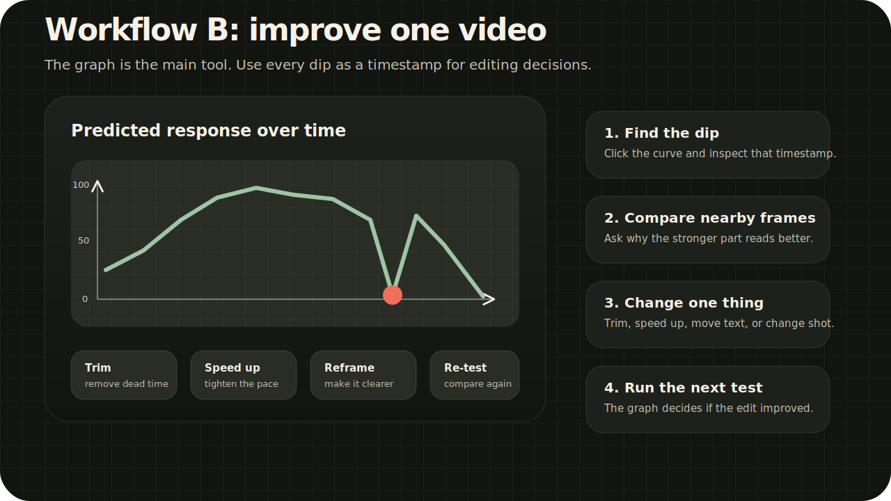

# TRIBE Review MVP

Private local web app for analyzing short video ads with Meta TRIBE v2 and presenting the result as an editing-friendly review.

The app runs the official TRIBE v2 inference path, visualizes the predicted brain-response curve and heatmap, and adds a practical recommendation layer for comparing cuts and finding weak moments in the timeline.

## Credits and sources

Application shell, interface, workflow layer, and practical editing wrapper:

- [AI Pulse](https://x.com/youraipulse)
- [Amir Mushich](https://x.com/AmirMushich)

Official model and research sources:

- [Meta AI publication](https://ai.meta.com/research/publications/a-foundation-model-of-vision-audition-and-language-for-in-silico-neuroscience/)
- [TRIBE v2 model page](https://huggingface.co/facebook/tribev2)

This repository is a non-commercial community prototype. It does not claim ownership over TRIBE v2, Meta research materials, model weights, brand assets, uploaded videos, or third-party materials. No sales, paid distribution, sublicensing, or commercial use are intended.

## What it does

- Reviews one uploaded video as a deep analysis.
- Compares 2-4 uploaded versions side by side.
- Shows a predicted response-over-time curve.
- Shows a 3D brain activity visualization.
- Explains the major brain zones used by the model.
- Adds practical editing recommendations.
- Exports JSON and PDF reports.
- Uses a local Whisper speech layer for transcript/timing hints.
- Optionally uses Ollama for local recommendation copy rewriting when a supported local model is available.

## What it is not

- It is not a commercial product.
- It is not an official Meta application.
- It is not a guaranteed virality predictor.
- It does not measure one specific real viewer.
- It does not claim ownership over TRIBE v2, Meta research assets, uploaded videos, or any third-party materials.

See [NOTICE.md](NOTICE.md) for the non-commercial notice and official source links.

## Main idea

The response graph is the primary tool.

Use the curve first, then use the video player, brain map, and recommendation cards to understand what is happening around the marked timestamps.

## Workflows

### A. Compare 2-4 versions

Use compare mode for several versions of the same creative. The goal is not to blindly pick one full video. The goal is to find the strongest sections across versions and use them as an editing map for the next cut.



Typical use:

1. Upload 2-4 variants of the same ad/video idea.
2. Compare the overlaid curves.
3. Mark which version has the strongest hook, middle hold, transitions, and later useful section.
4. Build a new edit from the best-performing blocks.
5. Re-run the new edit against the current leader.

### B. Improve one video

Use solo mode when you only have one cut. Look for real dips in the graph, click the timestamp, inspect nearby frames, and test one edit at a time.



Typical edits:

- Cut or shorten slow fragments.
- Speed up a section that drags.
- Move the main action or caption earlier.
- Make the subject larger or clearer.
- Remove visual clutter.
- Add a new beat before the graph drops.

Full workflow notes: [docs/WORKFLOWS.md](docs/WORKFLOWS.md)

## Project structure

```text
.
|-- app.py                         # FastAPI app and report routes
|-- bootstrap_models.py            # First-launch dependency and model preparation
|-- tribe_runtime.py               # TRIBE v2 model loading and inference wrapper
|-- official_report.py             # Official-output report layer
|-- review_engine.py               # Local recommendation and comparison logic
|-- brain_visualization.py         # Brain heatmap visualization data
|-- report_localization.py         # UI/report copy layer
|-- pdf_report.py                  # Chrome-based HTML-to-PDF export
|-- templates/index.html           # Main web UI
|-- static/vendor/                 # Local browser dependencies
|-- runtime_media/                 # Local runtime uploads/reports, ignored by Git
|-- docs/INSTALL_WINDOWS.md        # Windows setup guide
`-- docs/TROUBLESHOOTING.md        # Common issues
```

## Quick start on Windows

Unzip the repository archive into a normal folder, then run:

```powershell
Start_TRIBE_Review.cmd
```

The first launch creates `.venv`, installs Python dependencies, downloads the official TRIBE v2 model files, downloads the Whisper speech model, and prepares local video/audio decoding support. Keep the terminal open during this step.

When the terminal says setup is complete, close it and run:

```powershell
Start_TRIBE_Review.cmd
```

The browser should open automatically. If it does not, open:

```text
http://127.0.0.1:8000
```

Full setup notes: [docs/INSTALL_WINDOWS.md](docs/INSTALL_WINDOWS.md)

## Requirements

- Python 3.11
- Internet access on first launch
- Google Chrome for PDF export
- Hugging Face access for the official TRIBE v2 model files, if Hugging Face asks for it
- Optional NVIDIA CUDA environment for faster inference
- Optional Ollama for local copy rewriting

## Runtime data and privacy

Uploaded videos and generated reports are written to `runtime_media/`.

That folder is intentionally ignored by Git. Do not commit runtime media, reports, transcripts, tokens, logs, model weights, or cache folders.

## Development checks

Run a syntax check:

```powershell
python -m py_compile app.py bootstrap_models.py tribe_runtime.py speech_runtime.py official_report.py review_engine.py report_localization.py pdf_report.py brain_visualization.py runtime_setup.py
```

Run a smoke test with a local video:

```powershell
python smoke_test.py C:\path\to\test-video.mp4
```

## License and use

No open-source license is granted yet. Treat this repository as private, all-rights-reserved, non-commercial evaluation code unless a license is explicitly added later.

Review the official TRIBE v2 license and all third-party licenses before any redistribution or public use.
